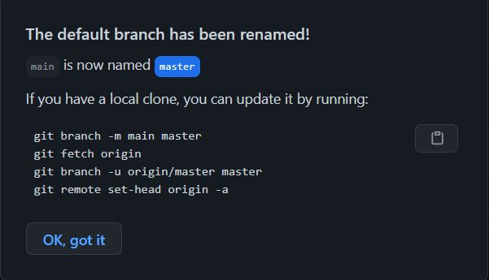

# Tutorial-git ^^

<a href="https://git-scm.com/downloads">Download Git</a>

<h3>Check version</h3>

```
git version
```
<h3>Save author</h3>
<h3>Config in the c drive</h3>

```
Git config --global user.name = “Your Name”
```
```
Git config --global user.email = “Your Mail”
```
```
Git config --global user.password = “Your Password”
```
Linux, mac
- no recommend, save in Hard Drive(run before type git config)
```
git config --global credential.helper store
```
- save in memory(run before type git config)
```
git config --global credential.helper "cache --timeout=18000"
```
```
google "gnome-keyring" "git shh"
```
## Concept
```
- Working directory
- Staging area
- Git Repository
```
Show remote list
```
git remote -v
```
## Syntax
### Check status folder
```
git status
```

### Create a repository in your pc
```
git init
```

### Add new file
```
git add "file name"
```
or
```
git add .
```

### Add commit
```
git commit -m"message"
```
or(add and commit)
```
git commit -a -m"message" 
```
### Git push
```
git push
```
```
git push origin <newbranch>
```
### Git log
Review commit history
```
git log
```
### Git show 
Show commit history and content
```
git show + (id commit)
```
### Git diff 
Review the contents of the 'modified' file
```
git diff
```
### Git clone
```
git clone
```
### Git pull
Download changes, synchronized
```
git pull
```
```
git pull origin <branchname> --allow-unrelated-histories
```
### Gitk
Review the modifications on the GUI
```
gitk
```
### Git reset
Unstage 'modified' file
```
git reset HEAD <file>
```
### Git checkout file
Delete 'modified' file
```
git checkout -- <file>
```
### Git branch and checkout
Create new branch
```
git checkout -b <branch name>
```
### Check branch
Check current branch 
```
git branch
```
Create branch A from branch B
```
git branch A B
```
### Git checkout
Switch to branch 'master' 
```
git checkout
```
### Git merge
Branch merge 
if you want B --> A
first you have to 'checkout A'
then:
```
git merge B
```
### Git delete branch
Delete branch 
```
git branch -D <branch name>
```
### Git reset
Undo commit by id,
<p>--soft: return to the state before commit</p>
<p>--mixed: return to the state before add</p>
<p>--hard: delete previous commits </p>

```
git reset --soft <id_commit>
```
```
git reset --mixed <id_commit>
```
```
git reset --hard <id_commit>
```
### Git revert
Return commit
```
git revert <id_commit>
```
### Create .gitignore
Ignore the file you don't want to commit
```
<file name>
```
### Git check remote
```
git remote -v
```
### Git fetch
- pull branch, can checkout the branch just fetch
```
git fetch origin <branch name on github>
```
### Git rebase
Conflict when 2 people access and edit the same file at the same time
```
git rebase <branch conflict>
```
### Git push --force
Overwrite commit history || no recommend
```
git push --force
```


